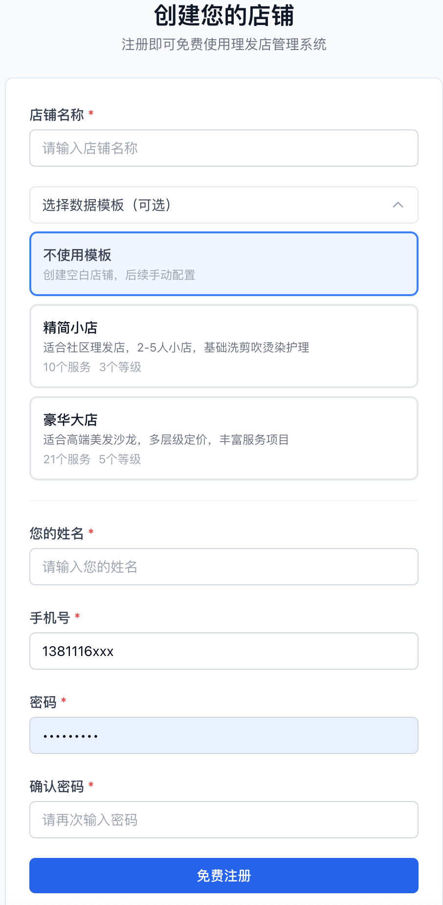
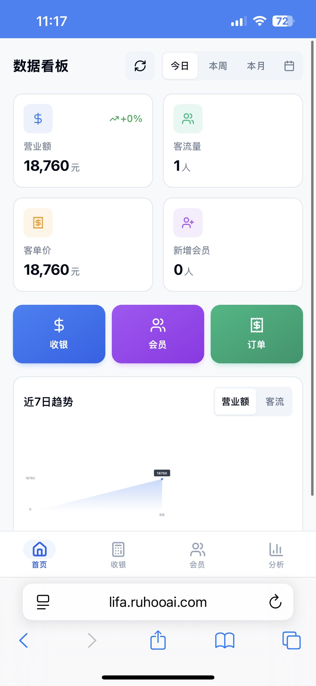

# ✂️ RH-HaireCut — 儒虎理发店管理系统

> 开箱即用的理发店数字化管理方案。注册即用，无需安装 App，手机/平板/电脑全端覆盖。

<p align="center">
[](https://lifa.ruhooai.com/register)
  
</p>

<p align="center"><strong>30 秒注册 → 立即开始营业</strong></p>

---

## 🚀 立即体验

| **系统登录** | [https://lifa.ruhooai.com/](https://lifa.ruhooai.com/) | **试用账号：** `13900000001`　**密码：** `owner123`
| **注册店铺(小店永久免费)** | [https://lifa.ruhooai.com/register](https://lifa.ruhooai.com/register) | 

---

## 💡 为什么选择 HaireCut？

传统理发店软件要么太贵，要么太复杂。HaireCut 专注解决一个问题：

**让理发店老板用最少的操作，管好会员、收银和营收。**

- 🚀 **零部署** — 浏览器打开即用，无需安装任何客户端
- 📱 **全端适配** — 手机开单、平板收银、电脑看报表，一个账号全搞定
- 🏪 **多店管理** — 一套系统服务多家门店，数据完全隔离
- 💰 **免费起步** — 核心功能开箱即用，按需解锁高级模块

---

## 🎬 产品预览

<p align="center">
  <a href="docs/preview.html">
    
  </a>
</p>

<p align="center">
  <a href="docs/preview.html">📱 查看完整系统预览（7 张截图）</a>
</p>

| 功能 | 说明 |
|------|------|
| 📊 **营收看板** | 今日营收、订单数、会员数据、趋势图表，打开手机就能看到 |
| 🧾 **快速开单** | 选择服务 → 结算 → 完成，支持余额/次卡/优惠券混合结算 |
| 🎫 **电子小票** | 门店专属水印，一键分享给顾客留存 |
| 👥 **会员管理** | 会员档案、余额、次卡、消费记录、偏好标签 |
| 📈 **会员分析** | 等级分布与消费趋势分析，精准运营有据可依 |
| ⚙️ **店铺设置** | 营业时间、服务项目、员工管理，电脑端灵活配置 |

---

## ✨ 核心功能

| 模块 | 功能说明 |
|------|----------|
| **收银开单** | 快速创建订单，支持余额 / 次卡 / 优惠券 / 线下支付混合结算 |
| **会员管理** | 会员档案、等级体系、自定义标签、充值赠送、消费记录 |
| **次卡 & 优惠券** | 灵活创建次卡套餐，发放/核销优惠券，到期自动提醒 |
| **服务管理** | 自定义服务分类与项目，设置价格、时长、指定员工 |
| **员工管理** | 角色权限（老板/店长/前台/发型师/技师），服务业绩统计 |
| **营收分析** | 日/周/月营收趋势、订单统计、员工业绩排行 |
| **订单管理** | 当日可取消退款、历史订单追溯、电子小票生成与分享 |
| **多店管理** | 每家门店独立数据空间，平台级统一管控 |

---

## 🛠 技术方案

### 架构概览

```
┌─────────────────────────────────────────────────┐
│                   Monorepo (pnpm + Turborepo)    │
├──────────────────────┬──────────────────────────┤
│   apps/web (Next.js) │   apps/server (NestJS)   │
│   App Router         │   REST API               │
│   Tailwind CSS       │   Prisma ORM             │
│   Radix UI           │   JWT Auth               │
│   响应式 (Mobile+PC) │   Multi-Tenant           │
├──────────────────────┴──────────────────────────┤
│              PostgreSQL (多租户隔离)               │
└─────────────────────────────────────────────────┘
```

### 技术栈

| 层级 | 技术选型 | 说明 |
|------|----------|------|
| **前端** | Next.js 15 + App Router | SSR/SSG，响应式布局，移动端优先 |
| **UI** | Tailwind CSS + Radix UI | 高可定制组件库，无障碍支持 |
| **后端** | NestJS | 模块化架构，装饰器风格 |
| **ORM** | Prisma | 类型安全的数据库访问 |
| **数据库** | PostgreSQL | 多租户数据隔离 |
| **认证** | JWT (access + refresh) | 多角色权限体系 |
| **部署** | Docker + Nginx | 一键部署脚本 |
| **包管理** | pnpm workspaces + Turborepo | Monorepo 构建加速 |

### 多租户设计

- 所有业务数据通过 `shopId` 字段隔离
- 请求级 `TenantMiddleware` 自动注入租户上下文
- 控制器通过 `@CurrentShop()` 装饰器获取当前店铺
- 统一的 `TransformInterceptor` 响应包装与异常过滤

### 关键业务流程

```
开单流程:  创建订单(PENDING) → 混合支付结算(SETTLED) → 余额/次卡自动扣减
退款流程:  当日订单 → 取消(REFUNDED) → 余额/次卡自动回退
会员支付:  赠送余额优先扣减 → 本金余额 → 次卡次数 → 优惠券
```

### 本地开发

```bash
# 安装依赖
pnpm install

# 启动数据库
docker compose up -d

# 初始化数据库
cd apps/server && pnpm prisma:migrate && pnpm prisma:seed

# 启动开发环境 (前端 :3000 + 后端 :4000)
pnpm dev
```

---

## 📄 License

[GNU LGPL-2.0](LICENSE)
